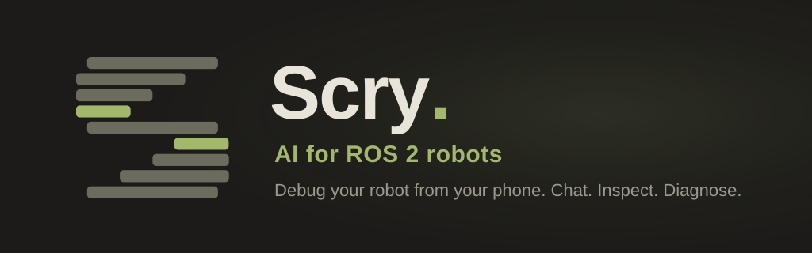
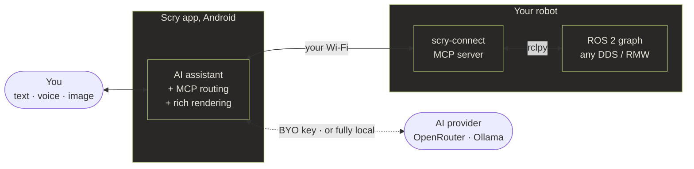

<div align="center">



# Scry

**Your ROS 2 robot, in your pocket.** Debug, monitor, and talk to any ROS 2 system from your Android phone, through an on-device AI assistant.

[](https://github.com/phaneron-robotics/scry-app/releases)
[](https://pypi.org/project/scry-connect/)
[](https://github.com/phaneron-robotics/scry-app/actions/workflows/ci.yml)
[](https://github.com/phaneron-robotics/scry-connect/actions/workflows/ci.yml)
[](https://phaneron-robotics.github.io/scry/get-started/install-connect/)
[](#license)

[**Docs**](https://phaneron-robotics.github.io/scry/) ·
[**Quick start**](#quick-start) ·
[**How it works**](#how-it-works) ·
[**Demos**](#demos)

<a href="https://play.google.com/store/apps/details?id=com.phaneronrobotics.scry"></a>

</div>

---

## What is Scry?

Debugging a ROS 2 robot usually means crouching at a laptop with `rviz`, `rqt`, and a wall of `ros2 topic echo` terminals. That's fine at your desk, but painful when you're walking beside the robot, demoing it, or out in the field. **Scry puts that whole workflow in your pocket:** you ask a question in plain English, like *"why isn't `/cmd_vel` publishing?"*, and an on-device AI assistant inspects your robot's topics, nodes, services, parameters, and diagnostics live over your own network, then answers with structured panels, plots, and one-tap actions. No cloud backend, no telemetry. Your AI key, your robot, your network.

---

## Demos

Short walkthroughs of Scry in action. Click any thumbnail to watch on YouTube, or browse the [full playlist](https://www.youtube.com/playlist?list=PLyorFDAYdKhSwHnjT1jQQy-Y-6_6wA7Kq).

### AI chat & debugging

| Debugging logs | Multi-step planning | Manual approvals |
|---|---|---|
| [](https://youtu.be/iM--2T5NY4A) | [](https://youtu.be/URhuoBcetH8) | [](https://youtu.be/Vc45jC7-fRA) |
| Ask about your robot's logs in plain English. | Watch the AI build and follow a plan. | The AI proposes, you approve each write. |

| Chat walkthrough | Parameters by chat | Camera feed in chat |
|---|---|---|
| [](https://youtu.be/V2PRj4fiPBo) | [](https://youtu.be/zIMt096yqfY) | [](https://youtu.be/ltE9LzJ3rTM) |
| Debug a robot end to end through chat. | Read and set ROS 2 parameters by asking. | Bring a live camera feed into the chat. |

### Browse ROS 2 entities

| Browse every ROS 2 entity |
|---|
| [](https://youtu.be/hjJ-Rxm-khI) |
| Topics, nodes, services, actions, lifecycle, params, TF, logs — searchable, one tap to detail. |

### Live visualizations

| Camera, LiDAR, plots & 3D scene |
|---|
| [](https://youtu.be/dGKybk0HN8E) |
| Sensor streams render live on a dedicated Viz surface. |

### Robot dashboard & fleet

| Robot dashboard + chat | Multi-robot fleet view |
|---|---|
| [](https://youtu.be/Xv22xBuKhKA) | [](https://youtu.be/IS0pWNuMoMY) |
| An honest, at-a-glance health view, paired with chat. | Switch between robots or diagnose the whole fleet. |

---

## How it works



The **phone is the thick client**. It runs the AI loop, routes tool calls, renders the results, keeps your background monitors running, and manages your fleet. The **robot just runs `scry-connect`**, a small Python MCP server that exposes its ROS 2 graph as **119 AI-callable tools**. Reads are free; anything that changes the robot asks for your approval first. Because cloud AI APIs can't reach your private Wi-Fi, the phone proxies every tool call between the AI and the robot, so nothing routes through a Scry server.

---

## Quick start

About fifteen minutes, end to end. Full walkthrough in the [**Get started guide**](https://phaneron-robotics.github.io/scry/get-started/).

### 1. Get the app

<a href="https://play.google.com/store/apps/details?id=com.phaneronrobotics.scry">Get Scry on Google Play →</a>

### 2. Install `scry-connect` on the robot

**pip** (simplest):

```bash
pip install scry-connect
source /opt/ros/$ROS_DISTRO/setup.bash
scry-connect
```

**Docker** (no Python setup, multi-arch, works on Jetson / Pi):

```bash
docker run --rm --network host \
  ghcr.io/phaneron-robotics/scry-connect:jazzy
```

It binds `0.0.0.0:5339`, LAN-only, and prints a pairing QR on startup.

### 3. Pair & ask

Scan the QR in the app, add an [AI provider](#ai-providers), and ask your first question:

> *"What's my robot's health?"*

[Install on Android](https://phaneron-robotics.github.io/scry/get-started/install-android/) ·
[Install scry-connect](https://phaneron-robotics.github.io/scry/get-started/install-connect/) ·
[Pair the phone & robot](https://phaneron-robotics.github.io/scry/get-started/pair/) ·
[First session](https://phaneron-robotics.github.io/scry/get-started/first-session/)

---

## AI providers

Bring your own key, or run **fully offline**. Provider and model are picked from the chat top-bar chip.

| Provider | Notes |
|---|---|
| [**OpenRouter**](https://openrouter.ai/) | **Recommended.** One key unlocks 300+ models (Claude, GPT, Gemini, Llama, and more) and has a free tier. |
| [**Ollama**](https://ollama.com/) | **Run a model locally**, on your own machine. No cloud, no key, fully offline. |

Scry sends inference through whichever you choose; it stores **only your credentials**, never your robot or chat data.

---

## What you can do

- **Debug by chatting.** Ask *"why isn't `/cmd_vel` publishing?"* and Scry inspects topics, nodes, services, and parameters live and explains what it found.
- **Voice & images.** Talk hands-free, or attach a screenshot and ask *"what's wrong in this scene?"* Transcription runs on your phone.
- **Act with one tap.** Publish a topic, set a parameter, call a service, or drive a lifecycle change. Every write shows exactly what it'll do and waits for your approval.
- **Background monitors.** Say *"alert me if `/odom` drops below 10 Hz"* and Scry watches, then pings you the moment a condition trips.
- **Live panels & plots.** Sensor readouts, scene snapshots, transform trees, and live plots render right in the chat.
- **Viz tab.** A dedicated long-running surface for a 3D scene view, camera feeds, behavior trees, a geomap, live plots, sensor panels, bag playback, and teleop.
- **Fleet view.** Monitor and compare multiple robots from one screen.

---

## Documentation

Everything lives at **[phaneron-robotics.github.io/scry](https://phaneron-robotics.github.io/scry/)**:

- **Get started:** [Overview](https://phaneron-robotics.github.io/scry/get-started/) · [Android](https://phaneron-robotics.github.io/scry/get-started/install-android/) · [scry-connect](https://phaneron-robotics.github.io/scry/get-started/install-connect/) · [Choose your AI](https://phaneron-robotics.github.io/scry/get-started/choose-ai/) · [Pair](https://phaneron-robotics.github.io/scry/get-started/pair/) · [First session](https://phaneron-robotics.github.io/scry/get-started/first-session/)
- **Use Scry:** [Chat](https://phaneron-robotics.github.io/scry/use/chat/) · [Attachments](https://phaneron-robotics.github.io/scry/use/attachments/) · [Voice](https://phaneron-robotics.github.io/scry/use/voice/) · [Monitors](https://phaneron-robotics.github.io/scry/use/monitors/) · [Remote](https://phaneron-robotics.github.io/scry/use/remote/)
- **How it works:** [Architecture](https://phaneron-robotics.github.io/scry/how-it-works/)
- **Reference:** [MCP tools](https://phaneron-robotics.github.io/scry/reference/mcp-tools/) · [Permissions](https://phaneron-robotics.github.io/scry/reference/permissions/)
- **Legal:** [Privacy](https://phaneron-robotics.github.io/scry/legal/privacy/) · [Data safety](https://phaneron-robotics.github.io/scry/legal/data-safety/) · [Security](https://phaneron-robotics.github.io/scry/legal/security/)

---

## Acknowledgements

Scry is built on the shoulders of great open source:

- [**ROS 2**](https://docs.ros.org/) & [**rclpy**](https://github.com/ros2/rclpy), the robot graph Scry speaks to.
- [**Model Context Protocol**](https://modelcontextprotocol.io/), the tool-calling standard `scry-connect` implements.
- [**OpenRouter**](https://openrouter.ai/) & [**Ollama**](https://ollama.com/), the inference layer Scry routes through (cloud or fully local).
- [**Jetpack Compose**](https://developer.android.com/jetpack/compose), [**Hilt**](https://dagger.dev/hilt/), [**OkHttp**](https://square.github.io/okhttp/), [**Room**](https://developer.android.com/jetpack/androidx/releases/room), the Android stack.

---

## License

Apache-2.0.

<div align="center">
<br>

Made with 💚 by the <a href="https://www.phaneronrobotics.com/">Phaneron Robotics</a> team.

</div>
