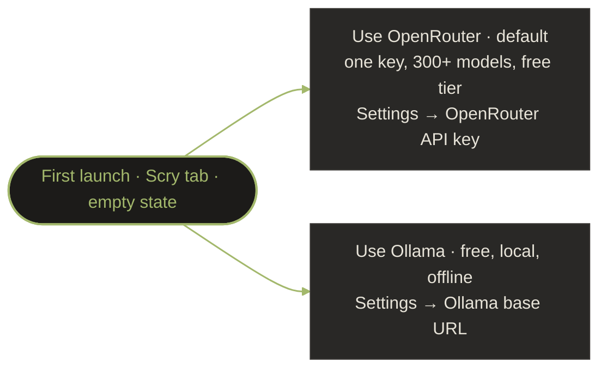

# Scry — AI Provider Strategy

## Problem

Tying the app to a single AI vendor creates friction:
- A per-vendor key (Anthropic, OpenAI, …) means an account + payment
  method per provider, and a new key whenever you want a different model
- Pinning model names in the app means an app update every time a
  vendor ships a new model
- Not all users want cloud-based AI — some run air-gapped robots

## Solution: Two Providers, One Unified Loop

Scry talks to AI behind a unified `AiClient` interface — the MCP
tool-call proxy loop is identical regardless of which one is active.
The app ships **two providers**, surfaced in **Settings → AI providers**:

| Provider | Where it runs | Cost | Pick it when… |
|----------|---------------|------|---------------|
| **OpenRouter** *(recommended, default)* | Cloud | Free open-weight models, or pay-per-token for premium | You want one key that unlocks every model, including Claude. |
| **Ollama** | Local (robot or any LAN host) | Free | You're offline / air-gapped or don't want any data leaving the LAN. |

A single OpenRouter key reaches Claude, GPT, Gemini, Llama, Qwen, and
300+ others, so Scry no longer ships separate per-provider key paths —
Claude is reached *through* OpenRouter. (The legacy `ClaudeClient` /
`OpenAiClient` / `GeminiClient` classes still exist in the codebase for
backward compatibility but are not exposed in the Settings UI; they'll
be removed in a follow-up.)

### 1. OpenRouter (Cloud, Multi-model) — Default

| Property | Value |
|----------|-------|
| Cost | Free open-weight models, or pay-per-token for premium models |
| API Key Required | One key (covers all routed models) |
| Internet Required | Yes |
| Default model | `openai/gpt-oss-120b:free` (free, tool-use capable) |
| Model selection | 300+ provider-prefixed slugs, picked from the chat top-bar chip |
| Tool Calling / Vision | Yes — depends on the routed model |
| Wire format | SSE, OpenAI-compatible chat-completions |

#### Recommended models

You pick the OpenRouter model from the chat top-bar chip. Three good
starting points:

| Use case | Model slug | Notes |
|----------|-----------|-------|
| **Best free** (general debugging) | `openai/gpt-oss-120b:free` | The default. Free, reliable tool-use, no credit card. Text-only. |
| **Best free for images** (vision + tools) | `google/gemma-4-26b-a4b-it:free` | Free Google multimodal — handles text **and** images and supports native tool calling, so it works with Scry's MCP tools. Use it when attaching photos or reading camera frames. |
| **Best paid** (deepest reasoning) | `anthropic/claude-haiku-4-5` | Cheap, fast, best-in-class tool-calling and multi-step diagnosis. |

!!! note "Free models need image **and** tool support"
    Scry drives everything through MCP tool calls, so a model is only
    useful here if `tools` is in its OpenRouter `supported_parameters`.
    Many free vision models (and the earlier Gemma 3 free variants) are
    image-capable but *not* tool-capable. Other free models that pass
    both bars today: `google/gemma-4-31b-it:free`,
    `moonshotai/kimi-k2.6:free`,
    `nvidia/nemotron-3-nano-omni-30b-a3b-reasoning:free`.

Browse the full live catalogue at
[openrouter.ai/models](https://openrouter.ai/models) (filter to Free +
check that the model lists `tools` and image input); any slug works in
the model picker.

#### Set up OpenRouter

1. In the app: **Settings → AI providers → OpenRouter**.
2. Tap **Sign up** — opens [openrouter.ai](https://openrouter.ai).
   Create a free account (no credit card needed for the free tier).
3. Tap **Get API key** — opens [openrouter.ai/keys](https://openrouter.ai/keys).
   Create a key and copy it.
4. Back in the app, paste the key into **OpenRouter API key**.
5. Open the chat top-bar chip and pick a model (start with the free
   default above).

### 2. Ollama (Local, Free) — Offline / Air-gapped

| Property | Value |
|----------|-------|
| Cost | Free |
| API Key Required | No |
| Internet Required | No |
| Runs On | Robot, local machine, or any reachable LAN host |
| Default model | `qwen2.5:7b` |
| Tool Calling | Supported (Llama 3.1+, Qwen 2.5+) |
| Vision | Supported (LLaVA, `qwen2.5-vl`) |
| Wire format | NDJSON + atomic `tool_calls` |

**Trade-offs**: weaker reasoning and lower tool-calling accuracy than
the cloud models (may need retries), but it never leaves your network —
ideal for air-gapped robots.

#### Set up Ollama

1. Install Ollama on the robot or any LAN host: see
   [ollama.com/download](https://ollama.com/download).
2. Pull a tool-capable model, e.g.:

    ```bash
    ollama pull qwen2.5:7b        # default; good tool-use at 7B
    ollama pull qwen2.5-vl        # add this if you need vision
    ```

3. Make sure Ollama listens on the LAN, not just loopback:

    ```bash
    OLLAMA_HOST=0.0.0.0:11434 ollama serve
    ```

4. In the app: **Settings → AI providers → Ollama**. Leave **Base URL**
   blank to auto-discover (Scry tries the paired robot's host on port
   `11434` first, then common defaults), or set it explicitly
   (`http://192.168.x.x:11434`).
5. Pick the pulled model from the chat top-bar chip.

## Implementation

The shipped interface lives in [`android/app/src/main/java/com/scry/data/ai/AiModels.kt`](https://github.com/phaneron-robotics/scry-android/blob/master/app/src/main/java/com/scry/data/ai/AiModels.kt) and looks like:

```kotlin
interface AiClient {
    val providerName: String
    val supportsVision: Boolean
    val supportsToolCalling: Boolean

    fun chat(
        messages: List<Message>,
        tools: List<Tool>,
        systemPrompt: String,
        model: String,
    ): Flow<ChatEvent>
}

sealed class ChatEvent {
    data class TextDelta(val text: String) : ChatEvent()
    data class ToolCallStarted(val id: String, val tool: String, val input: JsonObject) : ChatEvent()
    data class ToolCallCompleted(val id: String) : ChatEvent()
    data class MessageComplete(val message: Message) : ChatEvent()
    data class Error(val error: Throwable) : ChatEvent()
}

// Shipped implementations (data/ai/)
class OpenRouterClient(...) : AiClient   // default; OpenAI-compatible gateway
class OllamaClient(...) : AiClient       // local
// Legacy, not exposed in Settings UI — kept for backward compatibility:
class ClaudeClient(...) : AiClient
class OpenAiClient(...) : AiClient
class GeminiClient(...) : AiClient
```

`AiClientProvider` resolves the active client from
`SecurePrefs.selectedProvider` (default `"openrouter"`). The Settings
UI only offers OpenRouter and Ollama; the three single-provider clients
remain selectable in code for backward compatibility.

`AiProxyLoop` calls `chat(...)` once per turn, parses the resulting
event stream, dispatches `ToolUse` events either to `McpClient`
(connect tools) or to `handlePhoneSideTool` (meta tools like
`render_panel`, `monitor_threshold`, `fleet_overview`), and replays
`ToolUse`/`ToolResult` pairs into the next turn — so stateless
providers (Ollama, Gemini) work on session resume identically to
stateful ones.

## Onboarding Flow



Provider and model are then chosen via the **top-bar chip** on the chat
screen — the chip is the single source of truth, so you can swap models
mid-conversation without bouncing through Settings. The Settings screen
only stores the credentials.

If no provider is configured, the chat screen shows a setup prompt
guiding the user to Settings.

## API Key Storage

All API keys stored in Android `EncryptedSharedPreferences`:
- AES-256 encryption
- Backed by Android Keystore
- Never logged, never transmitted except to the provider's API
- User can view/edit/delete at any time in Settings

## Future: Scry Cloud (V2)

A backend proxy that holds our own API keys:
- Users pay a Scry subscription instead of managing API keys
- Freemium model: X free queries/month, paid tier for unlimited
- Simplifies onboarding to zero-config
- Requires cloud infrastructure (deferred to V2)
