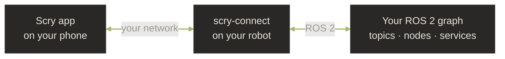

# How Scry works

Scry has two parts: the **app** on your phone and a small **server**,
`scry-connect`, on your robot. They talk directly over your network —
there is no Scry cloud in between.

## The phone does the thinking

Your phone is the brain. It runs the Scry assistant, decides which
actions to take on the robot, renders the results as readable panels and
charts, keeps your background monitors running, and manages your fleet
of robots. The AI provider you choose (see
[Choose your AI](get-started/choose-ai.md)) powers the assistant; your
phone talks to it directly.

## The robot just exposes its ROS 2 graph

`scry-connect` is a lightweight server you run on the robot. It makes the
robot's live ROS 2 graph — topics, nodes, services, parameters,
lifecycle, diagnostics, transforms, and more — available to Scry as a
set of safe, well-defined actions. It uses the standard ROS 2 client
libraries, so it works with **any** ROS 2 middleware (Fast-DDS,
CycloneDDS, Zenoh, Connext, and others). You don't configure any of
that — Scry follows whatever your robot already uses.

## What happens when you ask a question

1. You ask Scry something in plain language — by text, voice, or image.
2. Scry figures out which information it needs and asks `scry-connect`
   for it over your network.
3. The robot returns the data — a topic's rate, a node's connections, a
   diagnostic summary, a camera frame.
4. Scry reads the results, explains what they mean, and renders them as
   panels, plots, or tables instead of raw data.

Scry can chain several of these steps in one answer — for example,
reading a topic, then checking a related parameter — before giving you a
single, clear explanation.

## Reads are free; actions ask first

Scry separates two kinds of capability:

- **Reading** the robot — listing topics, inspecting nodes, checking
  diagnostics — happens freely. Nothing changes on the robot.
- **Acting** on the robot — publishing to a topic, setting a parameter,
  calling a service, triggering a lifecycle change — **always asks for
  your tap-to-approve first**. Scry shows you exactly what it intends to
  do, and nothing is sent until you approve it.

This is the core safety model: the assistant can suggest an action, but
**you** are always the one who authorizes it.

## No cloud backend

Everything runs between your phone, your AI provider, and your robot.
There is no Scry server collecting your data, no telemetry, and no
account required to connect to a robot on your own network. For a
full breakdown of what is stored and where, see the
[Privacy policy](legal/privacy.md).

For the full list of what Scry can inspect and do on a robot, see
[What Scry can do](reference/index.md).
