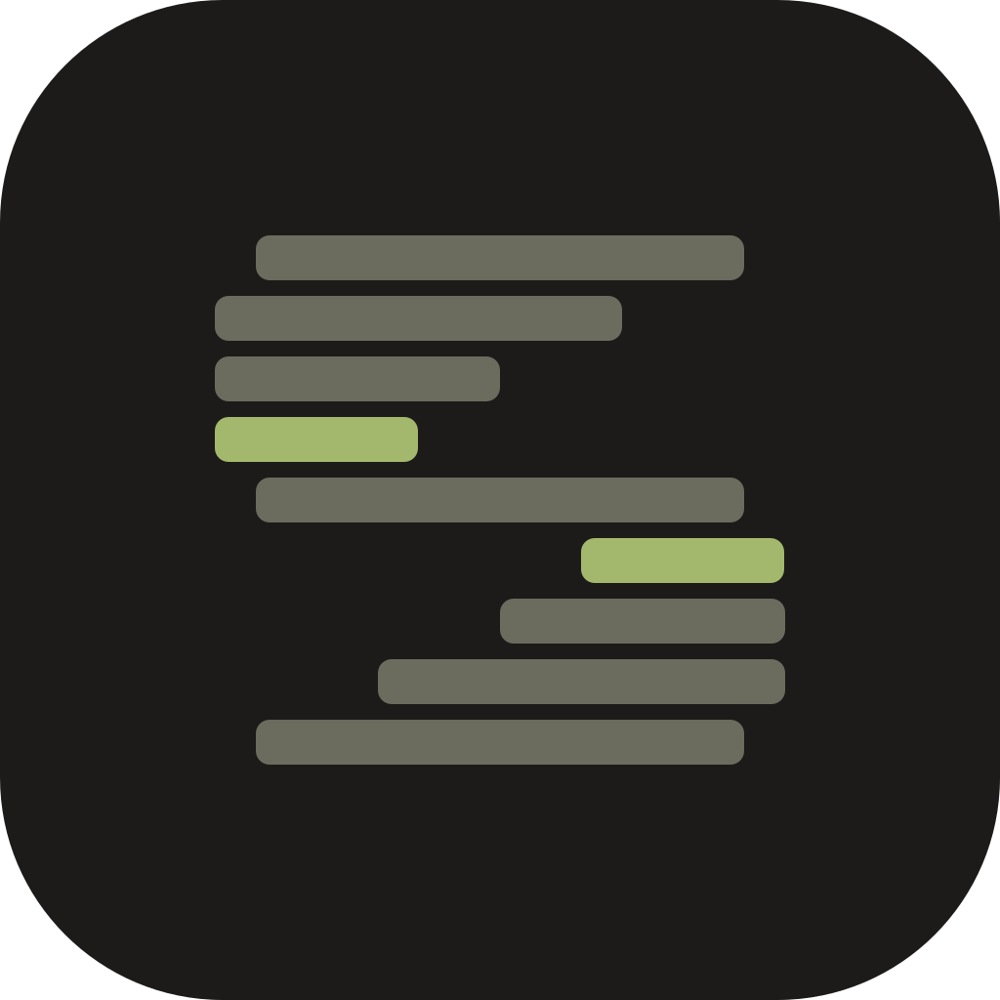
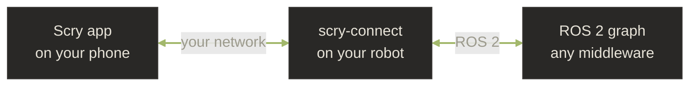

---
hide:
  - navigation
  - toc
title: Scry — debug your ROS 2 robot from your phone
description: Scry is a mobile app that lets you debug any ROS 2 robot through an on-device AI assistant. Inspect topics, call services, and monitor diagnostics by voice, text, or image, over your own network, with no cloud backend.
---

<h1 class="scry-hero__title">Scry.</h1>

Your ROS 2 robot, in your pocket. Debug topics, call services,
and monitor diagnostics by chatting with an on-device AI assistant.

  <a href="get-started/" class="md-button md-button--primary">Get started</a>
  <a href="how-it-works/" class="md-button">How it works</a>

What is Scry

Scry is a mobile app and a small robot server that together turn any
ROS 2 robot into something you can talk to. Ask a question in plain
English, by voice, or with a screenshot. Scry inspects your robot's
topics, nodes, services, parameters, and diagnostics live over your
network and answers with structured panels, plots, and links to deeper
views.

The phone does the work. The robot just exposes its ROS 2 graph. **No
cloud backend. No telemetry. Your AI key, your robot, your network.**

---

What you can do

-   :material-chat-processing: **Debug by chatting**

    Ask in plain language — *"why isn't `/cmd_vel` publishing?"* — and
    Scry inspects topics, nodes, services, and parameters live, then
    explains what it found.

-   :material-microphone: **Voice and images**

    Talk to your robot hands-free, or attach a screenshot or photo and
    ask *"what's wrong in this scene?"* Transcription runs on your phone.

-   :material-gesture-tap-button: **Act with one tap**

    Publish a topic, set a parameter, call a service, drive a lifecycle
    change — every action shows you exactly what it'll do and waits for
    your approval first.

-   :material-bell-ring: **Background monitors**

    *"Alert me if `/odom` drops below 10 Hz."* Scry watches in the
    background and pings you the moment a condition trips.

-   :material-chart-line: **Live panels and plots**

    Sensor readouts, scene snapshots, transform trees, and live plots
    render right in the chat — no raw JSON to squint at.

-   :material-wifi-off: **Yours, end to end**

    No cloud backend, no telemetry. Run it fully offline with a local
    model. Your AI key, your robot, your network.

---

What you can ask

> *Why is `/cmd_vel` not publishing?*

> *Plot the IMU acceleration for five seconds.*

> *Which nodes are using the most CPU right now?*

> *Set the `max_vel_x` parameter on the controller to 0.4 and confirm it took.*

> *Alert me if the battery drops below 20%.*

> *Which robot in my fleet is missing `/scan`?*

---

How it works

Your phone runs the assistant, decides what to check, renders the
results, keeps your monitors running, and manages your fleet. The robot
runs a small server, `scry-connect`, that exposes its ROS 2 capabilities
to Scry. Reads are free; anything that changes the robot asks for your
approval first. [Read more →](how-it-works.md)

---

What you need

- **A phone** running Android 9 or newer. (iOS coming soon.)
- **A ROS 2 robot** running Humble, Iron, Jazzy, Kilted, Lyrical, or
  Rolling.
- **An AI provider.** OpenRouter is recommended — one key unlocks 300+
  models and has a free tier. Prefer fully offline? Point Scry at a
  local Ollama server. See [Choose your AI](get-started/choose-ai.md).
- **Your network.** Phone and robot talk directly. Nothing routes
  through a cloud.

---

Where to go next

-   **Get started**

    Get the app, run `scry-connect` on the robot, choose your AI, pair,
    and ask your first question. About fifteen minutes end to end.

    [Get started](get-started/index.md)

-   **Use Scry**

    Chat with Scry, attach logs and images, set background monitors,
    and connect to your robot from anywhere.

    [Use Scry](use/index.md)

-   **How Scry works**

    The phone does the thinking, the robot just runs a small server.
    Why there's no cloud backend, and how actions stay safe.

    [How Scry works](how-it-works.md)

-   **Reference**

    Everything Scry can inspect and do on a robot, and the phone
    permissions the app uses.

    [Reference](reference/index.md)

-   **Legal**

    Privacy policy, Play Store Data Safety, security policy, and
    license.

    [Legal](legal/index.md)

---

Maintained by [Phaneron Robotics, Inc.](https://www.phaneronrobotics.com/)
